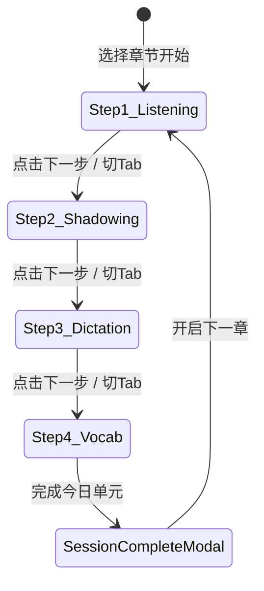

# Hogwarts Audio · 方案 C (Session 步骤流) 全面重构设计规范

## 1. 概述与核心定位 (Executive Summary)

### 1.1 业务与学习目标
将原版《哈利·波特》英语有声小说从单一的“字幕播放器”，升级为一个具备闭环教学法的**沉浸式学习工坊 (Language Acquisition Studio)**。
采用**方向 C：Session 步骤流 (Guided Learning Session)**，将以往散落在顶部栏、侧边抽屉、右侧工作台中的零碎功能，重组成一条具有清晰学习节奏的4步流水线：
1. **① 原版精听 (Immersive Listening)**：逐词指读、查词入库、盲听防干扰、沉浸阅读；
2. **② 影子跟读 (Shadowing Studio)**：原句 Track A / 录音 Track B 循环对照、Web Speech 发音评分；
3. **③ 拼写听写 (Dictation Studio)**：盲听单句听写、即时回车校对、字母级 diff 比对；
4. **④ 艾宾浩斯复习 (Vocab & Leitner Review)**：本课重点词与历史生词 5 盒抽认卡抽验、导出 Anki/PDF。

### 1.2 解决的痛点
- **彻底消除布局混乱**：不再使用生硬割裂的 55%:45% 左右分栏（手机端强行截断，桌面端右栏信息冗杂），采用**以当前步骤为主舞台**的响应式布局；
- **重构导航与信息架构**：消除 Header 上 7 个小图标堆叠的混乱局面，顶部只保留品牌、章节切换与辅助工具，主导航下沉为直观的 4-Step 进度药丸；
- **人因工学与排版提升**：解决单词粘连与行高过紧问题，严格执行 Apple HIG 44×44px 触控标准与 0 阴影高雅极简风格。

---

## 2. 界面布局体系与响应式架构 (Layout Architecture)

```
┌────────────────────────────────────────────────────────────────────────┐
│ Top Bar (h-14): Brand · [📖 Chapter 1 · The Boy Who Lived] · [📊][🎒][⚙️] │
├────────────────────────────────────────────────────────────────────────┤
│ Step Flow Bar (h-12):                                                  │
│   [ ① 精听原著 ]  →  [ ② 影子跟读 ]  →  [ ③ 拼写听写 ]  →  [ ④ 词汇复习 ]   │
├────────────────────────────────────────────────────────────────────────┤
│                                                                        │
│                      主舞台区域 (Flex-1, min-h-0)                         │
│                                                                        │
│   · Step 1 (精听): 桌面端 65%字幕流 + 35%当前句生词洞察; 手机端 100%全屏阅读  │
│   · Step 2 (跟读): 上下文原著句卡 + Track A/B 对比录音台 + AI波形评分         │
│   · Step 3 (听写): 听力盲听卡 + 极简输入框(防缩放16px) + 实时回车比对提示      │
│   · Step 4 (词汇): Leitner 5-box 翻转抽认卡 + 本章词汇汇总清单 + 导出入口      │
│                                                                        │
├────────────────────────────────────────────────────────────────────────┤
│ Smart Audio Player Bar (h-16 / h-18):                                  │
│ ━━━━━━━━━━━━━━━━━━━━━━━━━━━━━━━━━━━━━━━━━━━━━━━━━━━━━━━━━━━━━━━━━━━━━━ │
│ ◀◀ 10s   ▶ 播放   10s ▶  |  [02:14 / 08:35]  |  [1.0x] [🔂单句]  | [下一步 →] │
└────────────────────────────────────────────────────────────────────────┘
```

### 2.1 桌面端 (Desktop ≥ 768px)
- **Top Bar**: 高度 56px (`h-14`)，左侧 Brand，中间当前章节下拉胶囊，右侧保留学情仪表盘、离线行囊、快捷键与书架。
- **Step Bar**: 56px 居中四步药丸，支持任意点击直达，每一步标明序号与中文标签，激活态为 Royal Blue (`#2563EB`)。
- **Step 1 精听排版**:
  - 左侧 65%：经典骨白阅读纸张，居中宽度控制在 `max-w-2xl`，英文字体使用古典衬线字体，字号 `text-lg`，行高 `leading-[2.0]`，单词之间使用 `mr-[0.35em]` 间距，悬浮即时点词入库；
  - 右侧 35%：当前句子智能解析栏，显示当前句中文翻译、该句包含的初高中重点生词、一键跟读入口。
- **Step 2 跟读排版**: 居中工作台，顶部为当前挑战句子，中部为 A/B 轨道对比波形与录音按钮，底部为实时评估分数与发音弱点提示。
- **Step 3 听写排版**: 听力专注视窗，提供遮蔽模式，快捷键 `Tab` 重听单句，`Enter` 提交校对，直观显示红绿差异。
- **Step 4 词汇排版**: 艾宾浩斯 5 箱全览与今日待复习卡片大视图。
- **底部播放器**: 贴底 `shrink-0`，全宽进度条 + 居中播放控制簇 + 右侧「下一步 →」流转按钮。

### 2.2 移动端 (Mobile < 768px)
- **Top Bar**: 精简为 Logo、章节胶囊与书架图标；
- **Step Bar**: 横向平分 4 宫格或可滑动胶囊，触控区域均 ≥ 44px；
- **主舞台**: 纯 100% 单栏展示，无双栏分割，严禁横向溢出，各步骤专注一屏内完成；
- **底部播放器**: 简化核心按键（后退 10s、播放/暂停、前进 10s、单句循环、下一步），进度条置于最顶沿，单手可控。

---

## 3. 视觉系统与设计 Token (Design Tokens)

严格遵循 **03 极简书房 (Pure Reader)** 与 **educational-ui-spec** / **refactoring-ui-spec**：

| Token | 变量 / 颜色值 | 应用位置 |
|---|---|---|
| `--bg-base` | `#F8F8F6` (柔和骨白) | 全局背景、工作台次级底色 |
| `--surface-card` | `#FFFFFF` (纯净纸白) | 字幕卡片、输入框、抽认卡主体 |
| `--border-hairline` | `#E4E4E7` (1px/1.5px 极细边框) | 所有卡片、分割线、按钮边框 |
| `--text-primary` | `#18181B` (深炭黑) | 主标题、英文字幕主文字 |
| `--text-secondary` | `#52525B` (中性深灰) | 中文释义、说明正文 |
| `--text-muted` | `#71717A` (浅灰) | 音标、时间戳、快捷键提示 |
| `--accent-primary` | `#2563EB` (皇家蓝) | 步骤激活指示、主行动 CTA、重点高亮 |
| `--accent-active-cue` | `#D97706` (琥珀深金) | 正在播放句子的左边框与高光标记 |
| `--status-success` | `#059669` (森林墨绿) | 听写正确、熟记升级、发音优秀 |
| `--status-danger` | `#DC2626` (格兰芬多红) | 拼写错误、发音待加强 |

### 零阴影原则 (Zero-Shadow Rule)
全界面严禁使用 `shadow-lg`, `shadow-xl`, `shadow-2xl`，统一使用 1px/1.5px 极精细描边 (`border border-[#E4E4E7]`) 构筑层级。

### 零 Emoji 规范 (Zero-Emoji Rule)
所有界面元素 100% 采用 Lucide React / Lucide Vue Next 图标。

---

## 4. 状态流转与数据架构 (State Architecture)



1. **Pinia 统一状态**：
   - `sessionStore` 或 `playerStore.currentStep`（1, 2, 3, 4）
   - `subtitleStore`：维护当前播放时间戳、activeCueIndex、单句播放范围锁定
   - `vocabStore`：维护生词本与 Leitner 5 盒进阶
   - `analyticsStore`：记录各个步骤的有效学习时长与正确率
2. **切句与播放器联动**：
   - 在步骤 2（跟读）和步骤 3（听写）中，播放器自动启用「单句范围循环锁定」，仅在 `cue.start` 到 `cue.end` 之间循环播放，避免播放越界；
   - 切换到下一句时，各步骤自动加载下一句目标文本与音频片段。

---

## 5. 组件层级重构方案 (Component Hierarchy)

```
src/
├── App.vue                         // 全局主容器 (TopBar + StepBar + Stage + SmartAudioPlayer)
├── components/
│   ├── layout/
│   │   ├── TopHeader.vue           // 顶栏 (Brand + 章节胶囊 + 辅助工具入口)
│   │   └── StepTabBar.vue          // 4-Step 进度切换栏
│   ├── session/
│   │   ├── StepListening.vue       // 步骤 1：精听主舞台 (SubtitleStream + 侧边词汇速记)
│   │   ├── StepShadowing.vue       // 步骤 2：跟读主舞台 (A/B对比波形 + 录音打分)
│   │   ├── StepDictation.vue       // 步骤 3：听写主舞台 (盲听输入 + 拼写即时校对)
│   │   └── StepVocabReview.vue     // 步骤 4：词汇复习主舞台 (Leitner 抽认卡 + 导出)
│   ├── player/
│   │   └── SmartAudioPlayer.vue    // 智能流式播放器 (贴底、响应式、含单句循环与下一步)
│   └── modals/
│       ├── BookshelfDrawer.vue     // 书架选择抽屉
│       ├── AnalyticsDashboard.vue  // 学情仪表盘
│       ├── StorageManagerModal.vue // 离线存储管理
│       └── SessionCompleteModal.vue// 课时通关成就总结卡
```

---

## 6. 测试与验证策略 (TDD Verification Plan)

1. **单元测试与集成测试 (Vitest)**：
   - 验证 Step 切换时状态正确持久化
   - 验证单词点击收录生词不重复 (`vocabStore.addWord`)
   - 验证跟读模式下单句片段播放边界锁定
   - 验证听写模式下回车即时比对计算逻辑
2. **设计规范与安全自动化检查**：
   - `npm run check-emojis` 确保 0 违规 Emoji
   - `npm run verify-security` 确保 0 凭证泄漏
   - `npm test` 保证既有 38 个测试全部通过并增加新组件测试
   - `npm run build` 确保 Vite 零警告打包
